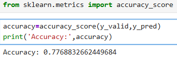
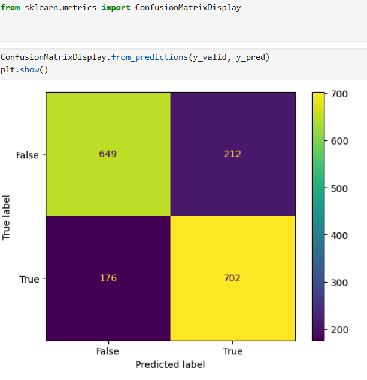
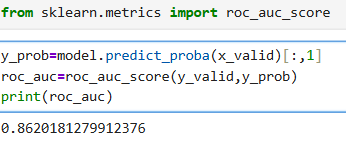

# 🚀 Spaceship Titanic Survival Prediction

## 📌 Project Overview

This project predicts whether passengers were transported to an alternate dimension using the **Spaceship Titanic** dataset from Kaggle.

The project demonstrates an end-to-end Machine Learning workflow, including data preprocessing, feature engineering, Logistic Regression model building, evaluation, and prediction.

---

## ✨ Features

- End-to-end Machine Learning classification project
- Data cleaning and preprocessing
- Missing value treatment
- Categorical variable encoding
- Feature engineering
- Train-Test Split (80% Training, 20% Validation)
- Logistic Regression model training
- Model evaluation using Accuracy Score
- ROC-AUC Score evaluation
- Confusion Matrix visualization
- Classification Report generation
- Prediction on unseen test dataset

---

## 📊 Dataset

**Dataset Source:**

https://www.kaggle.com/competitions/spaceship-titanic

### Files Used

- train.csv
- test.csv
- sample_submission.csv

---

## 🛠 Technologies Used

- Python
- Pandas
- NumPy
- Matplotlib
- Seaborn
- Scikit-learn

---

## 🤖 Machine Learning Model

- Logistic Regression

---

## 📈 Workflow

1. Data Cleaning
2. Missing Value Treatment
3. Encoding Categorical Variables
4. Feature Engineering
5. Train-Test Split (80% Training, 20% Validation)
6. Logistic Regression Model Training
7. Model Evaluation
8. Prediction on Test Dataset

---

# 📊 Model Performance

## Accuracy

**Accuracy:** **77.69%**

---

## ROC-AUC Score

**ROC-AUC Score:** **0.8620**

---

## Confusion Matrix

```
[[649 212]
 [176 702]]
```

| Actual | Predicted: False | Predicted: True |
|---------|-----------------:|----------------:|
| False | 649 (True Negative) | 212 (False Positive) |
| True | 176 (False Negative) | 702 (True Positive) |

---

## Classification Report

| Class | Precision | Recall | F1-Score | Support |
|------|----------:|-------:|---------:|--------:|
| False | 0.79 | 0.75 | 0.77 | 861 |
| True | 0.77 | 0.80 | 0.78 | 878 |

**Overall Accuracy:** **77.69%**

### Macro Average

| Metric | Score |
|--------|------:|
| Precision | 0.78 |
| Recall | 0.78 |
| F1-Score | 0.78 |

### Weighted Average

| Metric | Score |
|--------|------:|
| Precision | 0.78 |
| Recall | 0.78 |
| F1-Score | 0.78 |

---

# 📷 Project Screenshots

## 1. Dataset Preview (`train.head()`)

Displays the first five rows of the dataset.

.png)

---

## 2. Dataset Information (`train.info()`)

Displays the dataset structure, data types, and missing values.

.png)

---

## 3. Model Accuracy (`accuracy_score`)

Validation Accuracy: **77.69%**



---

## 4. Confusion Matrix (`ConfusionMatrixDisplay`)

Shows model predictions against actual values.



---

## 5. Classification Report (`classification_report`)

Displays Precision, Recall, F1-Score, and Support.


---

## 6. ROC-AUC Score (`roc_auc_score`)

ROC-AUC Score: **0.8620**



---

# 📂 Repository Structure

```
Spaceship-Titanic-Survival-Prediction/
│
├── images/
│   ├── train.head().png
│   ├── info().png
│   ├── accuracy_score.png
│   ├── ConfusionMatrixDisplay.png
│   ├── classification report.png
│   └── roc_auc_score.png
│
├── space_ship_titanic.ipynb
├── train.csv
├── test.csv
├── sample_submission.csv
├── README.md
└── LICENSE
```

---

# 🎯 Future Improvements

- Random Forest Classifier
- XGBoost Classifier
- Hyperparameter Tuning
- Feature Selection
- Cross Validation
- Model Deployment using Streamlit or Flask

---

# 👨‍💻 Author

**Nithish Ramesh**

**GitHub:** https://github.com/nithish86-bit

**LinkedIn:** https://www.linkedin.com/in/nithish-rbn
